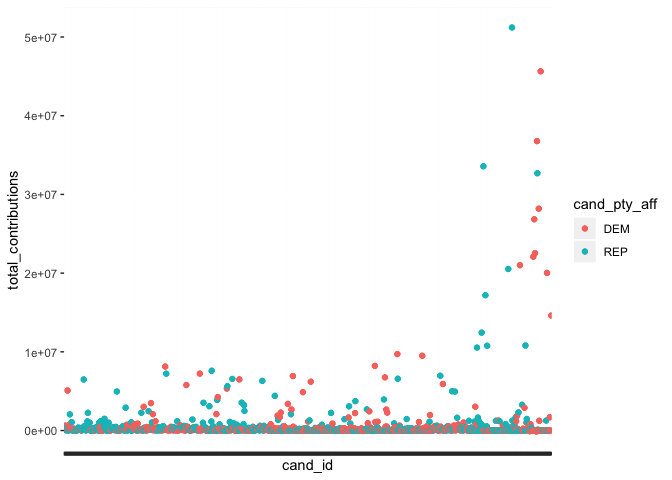
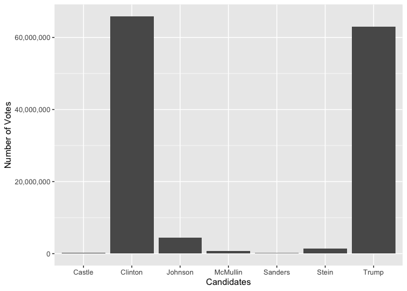

<!-- README.md is generated from README.Rmd. Please edit that file -->
fec16
=====

<!-- badges: start -->
[](https://www.tidyverse.org/lifecycle/#experimental) [](https://CRAN.R-project.org/package=fec16) <!-- badges: end -->

`fec16` contains candidate, committee and candidate-committtee linkage data for the United States 2015-2016 election cycle. To get an understanding of what leads to a win, we have various **a selection of x contributions??** contribution data along with state data of the election winners.

Installation
------------

`fec16` is hosted on GitHub and call be installed by running the following:

``` r
devtools::install_github("ranawg/fec16")
```

``` r
library(fec16)
```

Data
----

`candidates`: all candidates registered with the FEC during the 2015-2016 election cycle

`committees`: all committees registered with the FEC during the 2015-2016 election cycle

`results`: the results of the 2016 general presidential election

`committee_contributions`: total contributions, aggregated by candidate, from committees

`linkage`: provides linkage ID's for candidates and committees

Example
-------

### Data Wranging

<<<<<<< HEAD
`fec16` can be used to summarise data in order see how many candidates are running for elections (in all offices) for the two major parties:
=======
### Data Wranging

`fec16` can be used to summarise data in order see how many candidates
are running for elections (in all offices) for the two major parties:
>>>>>>> 62e4ac1cce08451f867b8d6899189d5abd5b1d7f

``` r
library(fec16)
library(tidyverse)
<<<<<<< HEAD
#> ── Attaching packages ──────────────────────────────────────────────────────────────────────── tidyverse 1.3.0 ──
#> ✔ ggplot2 3.2.1     ✔ purrr   0.3.3
#> ✔ tibble  2.1.3     ✔ dplyr   0.8.3
#> ✔ tidyr   1.0.0     ✔ stringr 1.4.0
#> ✔ readr   1.3.1     ✔ forcats 0.4.0
#> ── Conflicts ─────────────────────────────────────────────────────────────────────────── tidyverse_conflicts() ──
#> ✖ dplyr::filter() masks stats::filter()
#> ✖ dplyr::lag()    masks stats::lag()
=======
>>>>>>> 62e4ac1cce08451f867b8d6899189d5abd5b1d7f

candidates %>% filter(cand_pty_aff == "REP"|cand_pty_aff =="DEM") %>% group_by(cand_pty_aff) %>% summarise(size = n())
#> # A tibble: 2 x 2
#>   cand_pty_aff  size
#>   <fct>        <int>
#> 1 DEM           2242
#> 2 REP           2678
```

### Joining Data

<<<<<<< HEAD
A data wrangling example that uses two of the data frames could be:
=======
A data wrangling example that uses two of the data frames could
be:
>>>>>>> 62e4ac1cce08451f867b8d6899189d5abd5b1d7f

``` r
cand_cmte <- full_join(candidates, committees, by = "cand_id") %>% filter(cand_pty_aff == "REP"|cand_pty_aff =="DEM") %>% group_by(cand_pty_aff, committee_type) %>% summarise(n = n()) %>% drop_na(committee_type)
#> Warning: Factor `committee_type` contains implicit NA, consider using
#> `forcats::fct_explicit_na`
cand_cmte
#> # A tibble: 6 x 3
#> # Groups:   cand_pty_aff [109]
#>   cand_pty_aff committee_type     n
#>   <fct>        <fct>          <int>
#> 1 DEM          H               1540
#> 2 DEM          P                147
#> 3 DEM          S                278
#> 4 REP          H               1715
#> 5 REP          P                218
#> 6 REP          S                399
```

### Data Visualization

<<<<<<< HEAD
And extending that to create a visualisation to see the results easily.
=======
And extending that to create a visualisation to see the results
easily.
>>>>>>> 62e4ac1cce08451f867b8d6899189d5abd5b1d7f

``` r
ggplot(cand_cmte, aes(x = committee_type, y = n, fill = cand_pty_aff)) + geom_col(position = "dodge") +
  labs(title = "Bar Chart of Total Committees by Type and Party", x = "Committee Type", y = "Count", fill = "Candidate Party Affiliation")
```


Create a scatter-plot of total contributions per candidate, colored by party (only including Democrat and Republican)

``` r

joined_data <- candidates%>%
  full_join(committee_contributions, by = "cand_id") %>%
  filter(!is.na(total_contributions)) %>%
  filter(cand_pty_aff=="REP" | cand_pty_aff == "DEM") %>%
  filter(total_contributions <= 1e+08)
  
  p <- ggplot(joined_data, aes(x=cand_id, y=total_contributions, color = cand_pty_aff)) +
  geom_point() +
  geom_jitter() +
  theme(axis.text.x=element_blank())
  
p
```



Visualize the results of the elections and see how many poeple voted:

``` r
library(ggplot2)
library(dplyr)
library(scales)
<<<<<<< HEAD
#> 
#> Attaching package: 'scales'
#> The following object is masked from 'package:purrr':
#> 
#>     discard
#> The following object is masked from 'package:readr':
#> 
#>     col_factor
=======
>>>>>>> 62e4ac1cce08451f867b8d6899189d5abd5b1d7f

results_by_cand <- results %>% 
  drop_na(general_results, fec_id) %>%
 group_by(fec_id, last_name) %>%
  summarise(sum_votes = sum(general_results)) %>% 
  filter( sum_votes >100000)
  
  
 
ggplot(results_by_cand, mapping = aes(x = last_name, y = sum_votes) ) + 
  geom_col() + 
  xlab("Candidates") + 
  ylab("Number of Votes") +
  scale_y_continuous(labels = comma)
```


