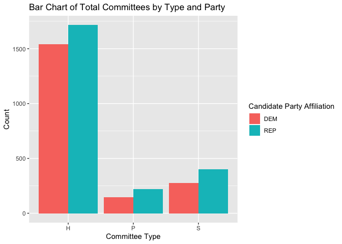

<!-- README.md is generated from README.Rmd. Please edit that file -->

# fec16 

<!-- badges: start -->

[](https://www.tidyverse.org/lifecycle/#maturing)
[](https://CRAN.R-project.org/package=fec16)
[](https://travis-ci.org/ranawg/fec16)
<!-- badges: end -->

**fec16** contains relational data from the Federal Election Commission
website pertaining to candidates and committees for the United States
2015-2016 election cycle. Additionally, result of the 2016 general
election and contribution data both from committees and individuals are
included.

## Installation

`fec16` is hosted on GitHub and call be installed by running the
following:

``` r
devtools::install_github("ranawg/fec16")
```

``` r
library(fec16)
```

## Data

`candidates`: all candidates registered with the FEC during the
2015-2016 election cycle

`committees`: all committees registered with the FEC during the
2015-2016 election cycle

`results`: the results of the 2016 general presidential election

`individuals`: a sample of 5000 individual contributions to
candidates/committees during the primary and general 2016 elections

`committee_contributions`: total contributions, aggregated by candidate,
from committees

## Examples

### Data Wrangling

`fec16` can be used to summarize data in order see how many candidates
are running for elections (in all offices) for the two major parties:

``` r
library(fec16)
library(tidyverse)
library(scales)

candidates %>% filter(cand_pty_aff == "REP"|cand_pty_aff =="DEM") %>% group_by(cand_pty_aff) %>% summarise(size = n())
#> # A tibble: 2 x 2
#>   cand_pty_aff  size
#>   <fct>        <int>
#> 1 DEM           2242
#> 2 REP           2678
```

#### Joining Data

We can join any of the datasets using `cand_id`. Each dataset with the
exception of the `individuals` dataset contains a possible joining key:
`cand_id`.

Here is an example of calculating how many candidates are in each of the
two major parties: Democratic (DEM) and Republican (REP), based on their
committee
type:

``` r
cand_cmte <- full_join(candidates, committees, by = "cand_id") %>% filter(cand_pty_aff == "REP"|cand_pty_aff =="DEM") %>% group_by(cand_pty_aff, committee_type) %>% summarise(n = n()) %>% drop_na(committee_type)
#> Warning: Factor `committee_type` contains implicit NA, consider using
#> `forcats::fct_explicit_na`
head(cand_cmte)
#> # A tibble: 6 x 3
#> # Groups:   cand_pty_aff [109]
#>   cand_pty_aff committee_type     n
#>   <fct>        <fct>          <int>
#> 1 DEM          H               1540
#> 2 DEM          P                147
#> 3 DEM          S                278
#> 4 REP          H               1715
#> 5 REP          P                218
#> 6 REP          S                399
```

### Data Visualization

And extending that to create a visualization to see the results
easily.

``` r
ggplot(cand_cmte, aes(x = committee_type, y = n, fill = cand_pty_aff)) + geom_col(position = "dodge") +
  labs(title = "Bar Chart of Total Committees by Type and Party", x = "Committee Type", y = "Count", fill = "Candidate Party Affiliation")
```



## Contributors

  - [Irene Ryan](https://github.com/ireneryan)
  - [Marium Tapal](https://github.com/mariumtapal)
  - [Rana Gahwagy](https://github.com/ranawg)
